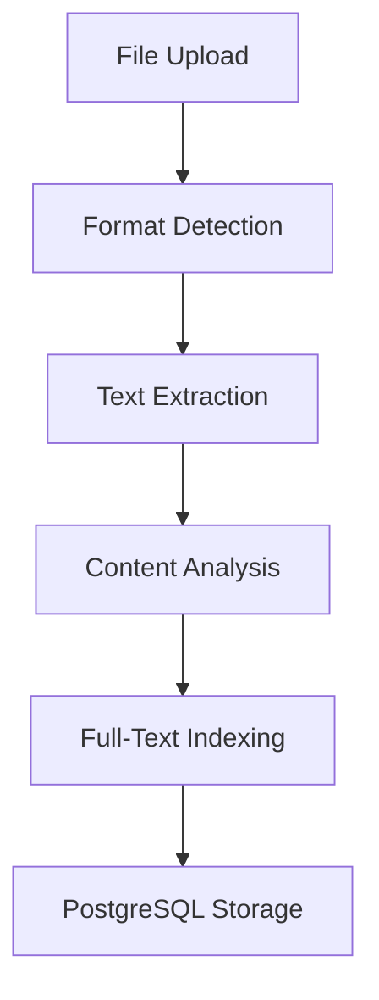

# Document Processing - Implementation PRD (MVP - No Vector Search)

**Version**: 2.0 (MVP Aligned)  
**Date**: 2024-01-15  
**Status**: Ready for Implementation  
**Estimated Time**: 20 hours (Week 2)  
**Priority**: Critical Path - Required for AI agents  
**Dependencies**: Backend Architecture (01-backend-architecture.md)  
**Key Changes**: Added PDF support, removed ALL vector embedding/semantic search functionality

---

## 🎯 **OVERVIEW**

### **Objective**

Build a simplified document processing pipeline that converts user files (.md, .txt, .pdf) into searchable, AI-ready knowledge base using PostgreSQL full-text search (NO vector embeddings).

### **Success Criteria (MVP)**

- Support markdown, txt, and PDF files up to 10MB
- NO vector embeddings, NO semantic search
- Use PostgreSQL full-text search ONLY
- Achieve <60 seconds processing time for 50-page documents
- Maintain >95% processing success rate
- Enable sub-1-second text search responses
- **Cost Target**: $0 for search indexing (no embedding costs)

---

## 🏗️ **TECHNICAL ARCHITECTURE**

### **Processing Pipeline Overview (MVP Simplified)**



### **Core Components (MVP)**

**File Processor**: Multi-format text extraction (.md, .txt, .pdf) with basic metadata
**Simple Chunker**: Basic content chunking for readability
**Full-Text Indexer**: PostgreSQL to_tsvector for search indexing
**NO Embeddings**: No vector generation, no pgvector
**Search Engine**: PostgreSQL full-text search ONLY

---

## 📋 **IMPLEMENTATION REQUIREMENTS**

### **Phase 1: File Processing Engine (Week 2 - 20 hours)**

#### **1.1 Multi-Format Text Extraction (8 hours)**

**Supported Format Processors**:

```typescript
interface DocumentProcessor {
  extractText(buffer: Buffer): Promise<ExtractedContent>;
  analyzeStructure(content: string): DocumentStructure;
  validateFormat(buffer: Buffer): boolean;
}

interface ExtractedContent {
  text: string;
  metadata: DocumentMetadata;
  structure: DocumentStructure;
  contentType: "markdown" | "plaintext" | "structured";
}

interface DocumentStructure {
  headers: HeaderNode[];
  sections: Section[];
  codeBlocks: CodeBlock[];
  links: Link[];
  tables: Table[];
}
```

**Markdown Processor Implementation**:

```typescript
class MarkdownProcessor implements DocumentProcessor {
  async extractText(buffer: Buffer): Promise<ExtractedContent> {
    const content = buffer.toString("utf-8");
    const ast = this.parseMarkdown(content);

    return {
      text: this.extractPlainText(ast),
      metadata: this.extractMetadata(ast),
      structure: this.analyzeStructure(ast),
      contentType: "markdown",
    };
  }

  private parseMarkdown(content: string) {
    // Use remark/unified for AST parsing
    // Extract frontmatter, headers, code blocks
    // Preserve link relationships
  }

  analyzeStructure(content: string): DocumentStructure {
    // Extract document hierarchy
    // Identify sections by headers (h1, h2, h3, etc.)
    // Map code blocks with language detection
    // Extract internal/external links
    // Parse tables with structure preservation
  }
}
```

**JSON/YAML Processor Implementation**:

```typescript
class StructuredDataProcessor implements DocumentProcessor {
  async extractText(buffer: Buffer): Promise<ExtractedContent> {
    const content = buffer.toString("utf-8");
    const parsed = this.parseStructuredData(content);

    return {
      text: this.flattenToText(parsed),
      metadata: this.extractMetadata(parsed),
      structure: this.analyzeStructure(parsed),
      contentType: "structured",
    };
  }

  private flattenToText(data: any): string {
    // Flatten nested objects into searchable text
    // Preserve key-value relationships
    // Extract string values for semantic search
  }
}
```

**Quality Requirements**:

- Handle files with non-UTF8 encoding gracefully
- Preserve document structure metadata for context
- Extract meaningful text from structured data formats
- Maintain character position mapping for highlighting
- Support incremental processing for large files

**Deliverable**: Multi-format document processors with structure analysis

#### **1.2 Content Analysis & Validation (6 hours)**

**Content Analysis Pipeline**:

```typescript
interface ContentAnalyzer {
  analyzeContent(content: ExtractedContent): ContentAnalysis;
  validateQuality(analysis: ContentAnalysis): ValidationResult;
  detectLanguage(text: string): string;
  estimateReadingTime(text: string): number;
}

interface ContentAnalysis {
  wordCount: number;
  readingTime: number;
  language: string;
  topics: string[];
  complexity: "simple" | "medium" | "complex";
  hasCode: boolean;
  hasImages: boolean;
  quality: QualityMetrics;
}

interface QualityMetrics {
  textDensity: number;
  structureScore: number;
  readabilityScore: number;
  uniquenessRatio: number;
}
```

**Quality Validation Rules**:

- Minimum 100 characters of meaningful text
- Maximum 80% duplicate content across chunks
- Language detection for non-English content handling
- Structure validation (proper heading hierarchy)
- Content-to-noise ratio analysis

**Error Handling**:

```typescript
class ProcessingError extends Error {
  constructor(
    public code:
      | "INVALID_FORMAT"
      | "CORRUPTED_FILE"
      | "EMPTY_CONTENT"
      | "TOO_LARGE",
    message: string,
    public details?: any
  ) {
    super(message);
  }
}
```

**Deliverable**: Content analysis system with quality validation

#### **1.3 Background Processing Queue (6 hours)**

**Job Queue Implementation**:

```typescript
import Bull from "bull";

interface DocumentProcessingJob {
  documentId: string;
  userId: string;
  filePath: string;
  fileType: string;
  processingOptions: ProcessingOptions;
}

interface ProcessingOptions {
  chunkSize: number;
  overlapSize: number;
  enableStructureAnalysis: boolean;
  generateSummary: boolean;
}

class DocumentProcessor {
  private queue: Bull.Queue<DocumentProcessingJob>;

  async processDocument(job: Bull.Job<DocumentProcessingJob>) {
    const { documentId, filePath, fileType } = job.data;

    try {
      // Update status to 'processing'
      await this.updateDocumentStatus(documentId, "processing", 10);

      // Extract content
      const content = await this.extractContent(filePath, fileType);
      await this.updateDocumentStatus(documentId, "processing", 30);

      // Chunk content
      const chunks = await this.chunkContent(content);
      await this.updateDocumentStatus(documentId, "processing", 60);

      // Generate embeddings
      await this.generateEmbeddings(documentId, chunks);
      await this.updateDocumentStatus(documentId, "completed", 100);
    } catch (error) {
      await this.updateDocumentStatus(documentId, "error", 0, error.message);
      throw error;
    }
  }
}
```

**Queue Configuration**:

- Concurrency: 5 concurrent document processing jobs
- Retry logic: 3 attempts with exponential backoff
- Progress tracking: Real-time status updates
- Priority queuing: Premium users get higher priority
- Dead letter queue: Failed jobs for manual review

**Deliverable**: Robust background processing system with error recovery

### **Phase 2: Semantic Chunking System (Week 3 - 15 hours)**

#### **2.1 Intelligent Chunking Algorithm (8 hours)**

**Chunking Strategy Implementation**:

```typescript
interface ChunkingStrategy {
  chunkDocument(content: ExtractedContent): Promise<DocumentChunk[]>;
  optimizeChunks(chunks: DocumentChunk[]): DocumentChunk[];
}

interface DocumentChunk {
  id: string;
  content: string;
  tokenCount: number;
  chunkIndex: number;
  sectionHierarchy: string[];
  chunkType: "text" | "code" | "table" | "list";
  contextBefore?: string;
  contextAfter?: string;
  metadata: ChunkMetadata;
}

class SemanticChunker implements ChunkingStrategy {
  private targetChunkSize = 450; // tokens
  private maxChunkSize = 600; // tokens
  private overlapSize = 50; // tokens

  async chunkDocument(content: ExtractedContent): Promise<DocumentChunk[]> {
    const chunks: DocumentChunk[] = [];

    // Chunk by document structure first
    for (const section of content.structure.sections) {
      const sectionChunks = await this.chunkSection(section, content);
      chunks.push(...sectionChunks);
    }

    // Optimize chunk boundaries
    return this.optimizeChunks(chunks);
  }

  private async chunkSection(
    section: Section,
    content: ExtractedContent
  ): Promise<DocumentChunk[]> {
    const chunks: DocumentChunk[] = [];
    let currentChunk = "";
    let tokenCount = 0;

    // Split by paragraphs first, then sentences if needed
    const paragraphs = section.content.split("\n\n");

    for (const paragraph of paragraphs) {
      const paragraphTokens = await this.countTokens(paragraph);

      if (tokenCount + paragraphTokens <= this.targetChunkSize) {
        currentChunk += paragraph + "\n\n";
        tokenCount += paragraphTokens;
      } else {
        // Complete current chunk
        if (currentChunk) {
          chunks.push(this.createChunk(currentChunk, section, chunks.length));
        }

        // Start new chunk with overflow paragraph
        if (paragraphTokens <= this.maxChunkSize) {
          currentChunk = paragraph + "\n\n";
          tokenCount = paragraphTokens;
        } else {
          // Split large paragraph by sentences
          const sentenceChunks = await this.splitBySentences(
            paragraph,
            section
          );
          chunks.push(...sentenceChunks);
          currentChunk = "";
          tokenCount = 0;
        }
      }
    }

    // Add final chunk
    if (currentChunk) {
      chunks.push(this.createChunk(currentChunk, section, chunks.length));
    }

    return chunks;
  }

  optimizeChunks(chunks: DocumentChunk[]): DocumentChunk[] {
    // Add context overlap between adjacent chunks
    for (let i = 0; i < chunks.length; i++) {
      if (i > 0) {
        chunks[i].contextBefore = this.extractContext(
          chunks[i - 1],
          this.overlapSize
        );
      }
      if (i < chunks.length - 1) {
        chunks[i].contextAfter = this.extractContext(
          chunks[i + 1],
          this.overlapSize
        );
      }
    }

    return chunks;
  }
}
```

**Chunking Quality Metrics**:

- Average chunk size: 400-500 tokens
- Chunk size variance: <20% deviation
- Boundary respect: 90% split at natural boundaries
- Context preservation: Semantic coherence score >0.8
- Overlap efficiency: Meaningful context in 90% of overlaps

**Deliverable**: Production-ready semantic chunking system

#### **2.2 Structure-Aware Processing (4 hours)**

**Specialized Handlers**:

```typescript
class CodeBlockChunker {
  chunkCodeBlock(codeBlock: CodeBlock): DocumentChunk[] {
    // Preserve entire functions/classes when possible
    // Split long code files by logical boundaries
    // Maintain syntax and import context
    // Add language-specific metadata
  }
}

class TableChunker {
  chunkTable(table: Table): DocumentChunk[] {
    // Keep table structure intact when possible
    // Split large tables by logical row groups
    // Preserve headers in each chunk
    // Maintain column relationships
  }
}

class ListChunker {
  chunkList(list: List): DocumentChunk[] {
    // Group related list items together
    // Respect nested list structure
    // Preserve item numbering/bullets
    // Maintain hierarchical context
  }
}
```

**Metadata Enrichment**:

```typescript
interface ChunkMetadata {
  documentId: string;
  sectionTitle: string;
  sectionHierarchy: string[];
  contentType: "text" | "code" | "table" | "list";
  language?: string;
  codeLanguage?: string;
  importance: number; // 0-1 based on position/structure
  keywords: string[];
  entities: string[];
}
```

**Deliverable**: Structure-aware chunking with rich metadata

#### **2.3 Chunk Quality Optimization (3 hours)**

**Quality Assessment**:

```typescript
interface ChunkQualityAnalyzer {
  assessChunk(chunk: DocumentChunk): QualityScore;
  optimizeChunkBoundaries(chunks: DocumentChunk[]): DocumentChunk[];
  detectPoorChunks(chunks: DocumentChunk[]): DocumentChunk[];
}

interface QualityScore {
  semanticCoherence: number; // 0-1
  informationDensity: number; // 0-1
  contextCompleteness: number; // 0-1
  boundaryQuality: number; // 0-1
  overallScore: number; // 0-1
}

class ChunkQualityAnalyzer {
  assessChunk(chunk: DocumentChunk): QualityScore {
    return {
      semanticCoherence: this.calculateCoherence(chunk),
      informationDensity: this.calculateDensity(chunk),
      contextCompleteness: this.checkContextCompleteness(chunk),
      boundaryQuality: this.assessBoundaries(chunk),
      overallScore: 0, // weighted average of above
    };
  }

  private calculateCoherence(chunk: DocumentChunk): number {
    // Use sentence embeddings to measure topic consistency
    // Check for topic drift within chunk
    // Validate logical flow of information
  }

  private calculateDensity(chunk: DocumentChunk): number {
    // Measure information content vs filler words
    // Check for meaningful keyword density
    // Assess unique concept coverage
  }
}
```

**Quality Improvement Strategies**:

- Re-chunk documents with <0.7 overall quality score
- Merge small, related chunks when possible
- Split chunks with poor semantic coherence
- Adjust boundaries to respect sentence/paragraph breaks

**Deliverable**: Quality-optimized chunking with automated improvement

### **Phase 3: Embedding Generation Engine (Week 3 - 15 hours)**

#### **3.1 OpenAI Integration & Optimization (6 hours)**

**Embedding Service Implementation**:

```typescript
class EmbeddingService {
  private openai: OpenAI;
  private cache: Redis;

  async generateEmbeddings(
    chunks: DocumentChunk[]
  ): Promise<EmbeddingResult[]> {
    const results: EmbeddingResult[] = [];

    // Check cache for existing embeddings
    const cacheChecks = await Promise.all(
      chunks.map((chunk) => this.checkCache(chunk.id))
    );

    // Identify chunks needing new embeddings
    const newChunks = chunks.filter((_, i) => !cacheChecks[i]);

    if (newChunks.length > 0) {
      // Batch process new embeddings
      const newEmbeddings = await this.batchGenerateEmbeddings(newChunks);
      results.push(...newEmbeddings);

      // Cache new embeddings
      await this.cacheEmbeddings(newEmbeddings);
    }

    // Combine cached and new results
    return this.combineResults(chunks, cacheChecks, results);
  }

  private async batchGenerateEmbeddings(
    chunks: DocumentChunk[]
  ): Promise<EmbeddingResult[]> {
    const batches = this.createBatches(chunks, 100); // 100 chunks per batch
    const results: EmbeddingResult[] = [];

    for (const batch of batches) {
      const batchResults = await this.processBatch(batch);
      results.push(...batchResults);

      // Rate limiting: wait between batches
      await this.wait(100); // 100ms between batches
    }

    return results;
  }

  private async processBatch(
    chunks: DocumentChunk[]
  ): Promise<EmbeddingResult[]> {
    const texts = chunks.map((chunk) => this.prepareTextForEmbedding(chunk));

    try {
      const response = await this.openai.embeddings.create({
        model: "text-embedding-3-small",
        input: texts,
        encoding_format: "float",
      });

      return response.data.map((embedding, index) => ({
        chunkId: chunks[index].id,
        embedding: embedding.embedding,
        model: "text-embedding-3-small",
        tokens: this.countTokens(texts[index]),
        cost: this.calculateCost(this.countTokens(texts[index])),
      }));
    } catch (error) {
      if (error.status === 429) {
        // Rate limit hit, wait and retry
        await this.wait(5000);
        return this.processBatch(chunks);
      }
      throw error;
    }
  }

  private prepareTextForEmbedding(chunk: DocumentChunk): string {
    // Combine chunk content with context
    let text = chunk.content;

    // Add section hierarchy as context
    if (chunk.sectionHierarchy.length > 0) {
      text = chunk.sectionHierarchy.join(" > ") + "\n\n" + text;
    }

    // Add contextual information
    if (chunk.contextBefore) {
      text = "..." + chunk.contextBefore + "\n\n" + text;
    }

    if (chunk.contextAfter) {
      text = text + "\n\n" + chunk.contextAfter + "...";
    }

    // Truncate if too long (8191 tokens max)
    return this.truncateToTokenLimit(text, 8000);
  }
}
```

**Cost Optimization Strategies**:

- Content-based caching to avoid re-processing identical chunks
- Batch processing to maximize API efficiency
- Smart rate limiting to stay within quotas
- Token counting for accurate cost tracking
- Fallback to smaller models for simple content

**Deliverable**: Optimized embedding generation with cost controls

#### **3.2 Caching & Performance Optimization (4 hours)**

**Multi-Level Caching Strategy**:

```typescript
class EmbeddingCache {
  private redis: Redis;
  private database: Database;

  async getEmbedding(chunkId: string): Promise<EmbeddingVector | null> {
    // Level 1: In-memory cache (fastest)
    let embedding = this.memoryCache.get(chunkId);
    if (embedding) return embedding;

    // Level 2: Redis cache (fast)
    embedding = await this.redis.get(`embedding:${chunkId}`);
    if (embedding) {
      this.memoryCache.set(chunkId, embedding);
      return JSON.parse(embedding);
    }

    // Level 3: Database (persistent)
    embedding = await this.database.getEmbedding(chunkId);
    if (embedding) {
      await this.redis.setex(
        `embedding:${chunkId}`,
        3600,
        JSON.stringify(embedding)
      );
      this.memoryCache.set(chunkId, embedding);
      return embedding;
    }

    return null;
  }

  async cacheEmbedding(
    chunkId: string,
    embedding: EmbeddingVector,
    ttl: number = 3600
  ): Promise<void> {
    // Store in all cache levels
    this.memoryCache.set(chunkId, embedding);
    await this.redis.setex(
      `embedding:${chunkId}`,
      ttl,
      JSON.stringify(embedding)
    );
    await this.database.storeEmbedding(chunkId, embedding);
  }

  async invalidateCache(documentId: string): Promise<void> {
    // Clear all caches for document chunks
    const chunkIds = await this.database.getChunkIds(documentId);

    // Clear from all cache levels
    for (const chunkId of chunkIds) {
      this.memoryCache.delete(chunkId);
      await this.redis.del(`embedding:${chunkId}`);
    }
  }
}
```

**Performance Monitoring**:

```typescript
interface EmbeddingMetrics {
  generationTime: number;
  cacheHitRate: number;
  apiCalls: number;
  totalCost: number;
  batchEfficiency: number;
}

class PerformanceMonitor {
  trackEmbeddingGeneration(metrics: EmbeddingMetrics): void {
    // Track performance metrics
    // Alert on degradation
    // Optimize based on patterns
  }
}
```

**Deliverable**: High-performance caching system with monitoring

#### **3.3 Vector Storage & Indexing (5 hours)**

**pgvector Integration**:

```typescript
class VectorStore {
  private db: Database;

  async storeEmbeddings(embeddings: EmbeddingResult[]): Promise<void> {
    const insertQuery = `
      INSERT INTO embeddings (chunk_id, model_name, embedding, created_at)
      VALUES ${embeddings.map(() => "(?, ?, ?, ?)").join(", ")}
      ON CONFLICT (chunk_id) 
      DO UPDATE SET 
        embedding = EXCLUDED.embedding,
        model_name = EXCLUDED.model_name,
        created_at = EXCLUDED.created_at
    `;

    const values = embeddings.flatMap((e) => [
      e.chunkId,
      e.model,
      `[${e.embedding.join(",")}]`, // pgvector format
      new Date(),
    ]);

    await this.db.query(insertQuery, values);
  }

  async searchSimilar(
    queryEmbedding: number[],
    limit: number = 10,
    threshold: number = 0.7,
    userId: string
  ): Promise<SearchResult[]> {
    const query = `
      SELECT 
        e.chunk_id,
        dc.content,
        dc.section_hierarchy,
        dc.chunk_type,
        d.filename,
        1 - (e.embedding <=> $1::vector) as similarity
      FROM embeddings e
      JOIN document_chunks dc ON e.chunk_id = dc.id  
      JOIN documents d ON dc.document_id = d.id
      WHERE d.user_id = $2
        AND 1 - (e.embedding <=> $1::vector) > $3
      ORDER BY e.embedding <=> $1::vector
      LIMIT $4
    `;

    return await this.db.query(query, [
      `[${queryEmbedding.join(",")}]`,
      userId,
      threshold,
      limit,
    ]);
  }

  async createIndexes(): Promise<void> {
    // Create HNSW index for fast similarity search
    await this.db.query(`
      CREATE INDEX IF NOT EXISTS embeddings_hnsw_idx 
      ON embeddings USING hnsw (embedding vector_cosine_ops) 
      WITH (m = 16, ef_construction = 64)
    `);

    // Create supporting indexes
    await this.db.query(`
      CREATE INDEX IF NOT EXISTS embeddings_chunk_id_idx 
      ON embeddings (chunk_id)
    `);
  }
}
```

**Index Optimization**:

- HNSW parameters tuned for accuracy/speed balance
- Automatic index maintenance and rebuilding
- Query performance monitoring and optimization
- Memory usage optimization for large vector collections

**Deliverable**: Optimized vector storage with fast similarity search

---

## ✅ **IMPLEMENTATION CHECKLIST**

### **Week 2 Deliverables**

- [ ] Multi-format document processors (MD, TXT, JSON, YAML)
- [ ] Content analysis and validation system
- [ ] Background processing queue with status updates
- [ ] Basic chunking algorithm with overlap
- [ ] OpenAI embedding generation integration
- [ ] Redis caching for embeddings and content

### **Week 3 Deliverables**

- [ ] Advanced semantic chunking with structure awareness
- [ ] Quality assessment and optimization system
- [ ] Batch embedding processing with cost optimization
- [ ] pgvector integration with HNSW indexing
- [ ] Vector similarity search with relevance filtering
- [ ] Performance monitoring and metrics collection

### **Quality Gates**

- [ ] 95%+ processing success rate for supported formats
- [ ] Average processing time <90 seconds for 50-page documents
- [ ] Chunk quality score >0.8 for 90% of generated chunks
- [ ] Embedding generation cost <$0.10 per average document
- [ ] Search response time <1 second for similarity queries
- [ ] Cache hit rate >80% for repeat operations

---

## 📊 **SUCCESS METRICS**

### **Processing Performance**

- **Success Rate**: >95% for all supported file formats
- **Processing Speed**: <90 seconds for 50-page documents
- **Memory Usage**: <512MB peak during processing
- **Error Recovery**: <1% unrecoverable processing failures

### **Embedding Quality**

- **Generation Cost**: <$0.10 per document average
- **Cache Hit Rate**: >80% for repeat content
- **Search Accuracy**: >85% relevance for semantic queries
- **Response Time**: <1 second for similarity search

### **System Reliability**

- **Queue Processing**: >99% job completion rate
- **Error Handling**: Graceful degradation for all failure modes
- **Data Integrity**: Zero data loss during processing
- **Scalability**: Handle 1000+ documents per hour

---

**This document processing system creates the intelligent knowledge base foundation that enables AI agents to understand and work with user content at scale.**
