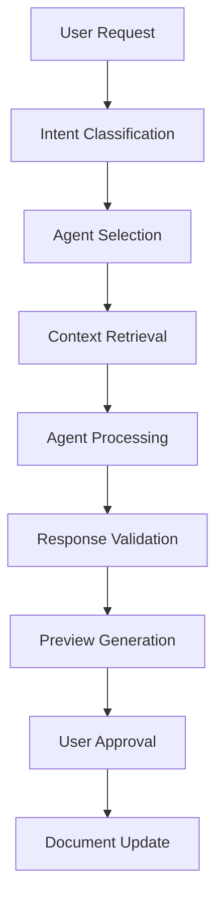

# Centrid.ai AI Agent Execution System - Product Requirements

**Version**: 4.0 (MVP Aligned - Claude Sonnet with claude agent sdk + Templates)
**Date**: 2024-01-15
**Status**: Ready for Implementation
**Estimated Time**: 40 hours (Weeks 2-3)
**Priority**: Core Innovation - Product Differentiator
**Dependencies**: Document Processing (02-document-processing.md), Backend (01-backend-architecture.md)
**Key Changes**: Claude Sonnet only, template system, full-text search context, selected/relevant documents

---

## 🎯 **OVERVIEW**

### **Objective (MVP)**

Build AI agents using **Claude Sonnet** (single model) with claude agent sdk with context from selected or relevant documents via PostgreSQL full-text search, with real-time progress updates via supabase

### **Success Criteria (MVP)**

- AI agents use selected/relevant documents as context via text search
- Create agent generates complete documents with template support
- Edit agent makes contextually appropriate modifications with real-time progress
- Research agent synthesizes insights across multiple documents using text search
- **Quality Target**: 85% user approval rate on first try
- **Performance Target**: <10 second response time for agent requests
- **Real-time Updates**: Live progress updates via supabase
- **Model**: Claude Sonnet ONLY for all operations

---

## 🤖 **AI AGENT ARCHITECTURE**

### **Core Agent Framework**

### **Agent Types & Capabilities**

**Create Agent**: Generates new content using knowledge base patterns
**Edit Agent**: Modifies existing content with contextual awareness
**Research Agent**: Synthesizes information across documents
**Code Agent**: Specialized for technical documentation and code analysis (Future)
**Summary Agent**: Creates summaries and abstracts (Future)

---

## 📋 **FUNCTIONAL REQUIREMENTS**

### **Phase 1: Agent Engine Foundation (Week 4 - 20 hours)**

#### **1.1 Request Processing & Classification (6 hours)**

**Intent Classification System**

- Must automatically detect user intent from natural language requests
- Should assess request complexity (simple, medium, complex)
- Must estimate token usage for cost prediction
- Should support explicit agent type override by user

**Request Pattern Detection**

- Create indicators: "write", "create", "generate", "new", "document", "draft"
- Edit indicators: "edit", "modify", "change", "update", "improve", "rewrite"
- Research indicators: "find", "search", "analyze", "summarize", "what", "explain"

**Agent Routing**

- Must route classified requests to appropriate agent
- Should track execution metrics (time, tokens, cost)
- Must handle agent failures gracefully with error tracking
- Should support request retry with exponential backoff

**Request Validation**

- Must validate request schema with Zod
- Required fields: id, userId, content, agentType, timestamp
- Optional fields: targetLocation, context, preferences
- Content length: 1-5000 characters
- Must validate UUID formats for ids

#### **1.2 Context Retrieval & Building (8 hours)**

**Document Context System**

- Must retrieve relevant chunks
- Should support filtering by selected documents or search all
- Must limit context to prevent token overflow (6000 tokens max)
- Should prioritize chunks by relevance score (>0.7 threshold)
- Must deduplicate similar content to avoid redundancy

**User Pattern Recognition**

- Should analyze user's writing style from previous documents
- Must extract common document structures
- Should identify frequently used terminology
- Must adapt to user's preferred technical depth
- Should include code style analysis for technical content

**Context Optimization**

- Must remove redundant information
- Must enforce token limits (70% for chunks, 30% for patterns/history) what would be left for processing?
- Should prioritize by relevance and recency
- Should include recent agent history for continuity (5 most recent)

**Context Components**

- Relevant document chunks (up to 20)
- User writing patterns
- Recent agent interaction history
- Total token count
- Confidence score

#### **1.3 AI Model Integration (4 hours)**

**Claude Sonnet Service**

- Must integrate Anthropic API with Claude agent sdk
- Should configure temperature per agent type (0.1-0.7 range)
- Must track token usage (input + output)
- Should calculate cost per request
- Must implement retry logic with exponential backoff (3 attempts max)
- Should handle rate limiting gracefully

**Model Configuration**

- Create: temperature 0.7, max 3000 tokens
- Edit: temperature 0.3, max 2000 tokens
- Research: temperature 0.1, max 4000 tokens

**Error Handling**

- Must retry failed requests up to 3 times
- Should use exponential backoff (1s, 2s, 4s)
- Must log all failures for monitoring
- Should provide user-friendly error messages

---

### **Phase 2: Agent Implementation (Week 5 - 22 hours)**

#### **2.1 Real-time Progress Updates (6 hours)**

**Progress Tracking**

- Must provide real-time updates during agent execution
- Should update at key milestones: 0% → 20% → 40% → 60% → 80% → 100%
- Must use Supabase real-time subscriptions for sub-second latency
- Should integrate with Valtio state management if needed
- Must handle connection failures gracefully

**Progress States**

- Pending: Request received, waiting to start
- Processing: Agent actively working
- Validating: Quality checks in progress
- Completed: Results ready for preview
- Failed: Error occurred with details

**Real-time Events**

- Database updates to `agent_requests.progress`
- WebSocket broadcasts to connected clients
- State synchronization across tabs/devices

#### **2.2 Create Agent (12 hours)**

**Template System**

- Must provide pre-built document templates
- Should support: API docs, blog posts, meeting notes, technical specs
- Must allow template selection via natural language
- Should fill placeholders intelligently from context

**Template Categories**

- Technical: API documentation, technical specifications, how-to guides
- Content: Blog posts, articles, social media content
- Business: Meeting notes, reports, proposals
- Personal: Notes, journals, checklists

**Content Generation**

- Must match user's writing style from patterns
- Should maintain consistency with existing documents
- Must use terminology from knowledge base
- Should preserve technical depth level
- Must generate well-formatted markdown
- Should include code examples when appropriate

**Quality Validation**

- Must check minimum content length (100 characters)
- Should validate markdown formatting
- Must verify code block syntax
- Should assess structure consistency
- Must calculate quality score (0-1 scale)

#### **2.3 Edit Agent (8 hours)**

**Edit Request Parsing**

- Must extract target text from selection
- Should parse edit instructions from natural language
- Must support structured formats (code blocks)
- Should handle both explicit and implicit selections

**Edit Approaches**

- Primary: Focused improvements preserving style
- Conservative: Minimal changes, essential only
- Aggressive: Comprehensive restructuring for clarity
- Must generate all three for user choice

**Context-Aware Editing**

- Must preserve surrounding document context
- Should maintain user's writing patterns
- Must keep consistent terminology
- Should respect document flow and structure
- Must preserve technical detail level

**Edit Quality Assessment**

- Meaning preservation score (0-1)
- Style consistency score (0-1)
- Improvement quality score (0-1)
- Context fit score (0-1)
- Overall quality score (average)

#### **2.4 Research Agent (7 hours)**

**Research Strategy Planning**

- Must analyze query complexity
- Should determine research approach based on query type
- Must generate multiple search queries for comprehensive coverage
- Should estimate required depth (moderate vs deep)

**Query Types**

- Factual: Direct information retrieval
- Analytical: Pattern analysis and synthesis
- Comprehensive: Broad search with categorization

**Multi-Source Synthesis**

- Must search across multiple documents
- Should retrieve 20-30 relevant chunks
- Must deduplicate findings
- Should group findings by themes/topics
- Must assess coverage and confidence

**Research Output Structure**

- Executive summary (2-3 sentences)
- Main findings organized by themes
- Patterns and cross-cutting insights
- Gaps and limitations identified
- Source attribution with relevance scores
- Suggested follow-up questions

**Research Quality Metrics**

- Comprehensiveness (0-1)
- Accuracy (0-1)
- Source reliability (0-1)
- Synthesis quality (0-1)
- Actionability (0-1)

---

### **Phase 3: Quality & Integration (Week 6 - 20 hours)**

#### **3.1 Response Validation & Quality Control (8 hours)**

**Quality Gates System**

- Must validate all agent responses before preview
- Should run required and optional quality checks
- Must calculate weighted quality scores
- Should generate improvement recommendations

**Quality Checks**

- Content length (required, weight 0.1)
- Format validity (required, weight 0.2)
- Context relevance (required, weight 0.3)
- Style consistency (optional, weight 0.2)
- Factual accuracy (optional, weight 0.2)

**Quality Thresholds**

- Overall score must be ≥0.7 to pass
- All required checks must pass
- Optional checks contribute to score but don't block

**Automatic Improvement**

- Should attempt to improve responses scoring 0.7-0.8
- Must not modify responses scoring ≥0.8
- Should retry generation for responses scoring <0.7
- Must track improvement success rates

#### **3.2 Preview Generation (6 hours)**

**Preview Components**

- Original user request
- Generated content with formatting
- Confidence score
- Source attribution (document references)
- Alternative options (2-3 variations)
- Metadata (tokens, cost, processing time)

**Diff Visualization** (for edits)

- Must show original vs modified side-by-side
- Should highlight specific changes
- Must calculate change statistics (additions, deletions, modifications)
- Should support unified diff format

**Source Attribution**

- Must link to source documents
- Should show relevant excerpts (100 characters)
- Must display relevance scores
- Should preserve section hierarchy

**Alternative Generation**

- Different tone/style options (formal, concise)
- Different structure (bullet points, paragraphs)
- Different emphasis (technical, accessible)

#### **3.3 Usage Tracking & Cost Management (6 hours)**

**Usage Event Tracking**

- Must log every agent request
- Should track: userId, agentType, tokens, cost, success, time
- Must store for analytics and billing
- Should aggregate by user and time period

**Quota Management**

- Must enforce plan-based limits
- Free tier: 100 requests/month
- Pro tier: 1000 requests/month
- Enterprise: 10000 requests/month
- Should notify users approaching limits (80% threshold)
- Must block requests exceeding quota

**Usage Analytics**

- Total requests by period (day/week/month)
- Total tokens consumed
- Total cost incurred
- Average response time
- Agent type breakdown
- Model usage breakdown
- Success rate tracking
- Quality score trending
- Projected usage forecasting

**Cost Optimization**

- Should detect opportunities for model downgrade
- Must cache similar requests to avoid redundant processing
- Should optimize context size for large requests
- Must recommend optimizations below 25% risk threshold

---

## ✅ **IMPLEMENTATION CHECKLIST**

### **Week 4 Deliverables**

- [ ] Request classification and agent routing system
- [ ] Context retrieval with user pattern recognition
- [ ] Claude Sonnet integration with retry logic
- [ ] Basic agent execution framework
- [ ] Usage tracking and cost calculation
- [ ] Error handling and retry logic

### **Week 5 Deliverables**

- [ ] Create Agent with template system and style matching
- [ ] Edit Agent with context-preserving modifications
- [ ] Research Agent with multi-source synthesis
- [ ] Content quality assessment systems
- [ ] Agent response validation and improvement
- [ ] Alternative generation for user choice

### **Week 6 Deliverables**

- [ ] Response validation with quality gates
- [ ] Preview generation system with diff visualization
- [ ] Mobile-optimized preview interfaces
- [ ] Usage analytics and quota management
- [ ] Cost optimization recommendations
- [ ] Performance monitoring and alerting

### **Quality Gates**

- [ ] 85% user approval rate on agent outputs
- [ ] <10 second average response time for agents
- [ ] > 90% agent request success rate
- [ ] Quality score >0.8 for generated content
- [ ] Cost per request <$0.05 for simple tasks, <$0.20 for complex
- [ ] Mobile preview interface loads in <2 seconds

---

## 📊 **SUCCESS METRICS**

### **Agent Performance**

- **Approval Rate**: 85%+ first-try approval from users
- **Response Time**: <10 seconds average across all agents
- **Quality Score**: >0.8 average quality rating
- **Success Rate**: >90% successful agent executions

### **User Experience**

- **Agent Adoption**: 70% of users try agents within first week
- **Usage Frequency**: Average 8 agent requests per user per week
- **Satisfaction**: 4.5+ stars for agent quality
- **Productivity**: Users report 3x faster content creation

### **Technical Performance**

- **System Reliability**: 99.5% uptime for agent system
- **Error Recovery**: <1% unrecoverable agent failures
- **Cost Efficiency**: <$0.10 average cost per successful request
- **Model Optimization**: 90% requests use optimal model selection

---

## 🚀 **SUPABASE EDGE FUNCTIONS INTEGRATION**

### **Architecture Enhancements**

#### **AI Processing Infrastructure**

- **From**: Vercel serverless functions with 5-minute timeout limits
- **To**: Supabase Edge Functions with unlimited execution time
- **Benefit**: Handle 15+ minute complex AI operations, global edge deployment

#### **Real-time Progress Updates**

- **Benefit**: Live progress bars, better UX, 90% fewer API requests

#### **Context Retrieval System**

- **From**: Custom vector search API with separate caching layer
- **To**: Direct pgvector queries with built-in connection pooling
- **Benefit**: Faster context retrieval, reduced latency, simpler architecture

#### **Authentication & Security**

- **From**: Custom JWT validation middleware in each function
- **To**: Built-in Supabase Auth integration with RLS policies
- **Benefit**: Automatic user verification, database-level security

### **Edge Functions Implementation Strategy**

Five focused Edge Functions to implement:

1. **`execute-create-agent`**: Content generation with knowledge base context
2. **`execute-edit-agent`**: Content modification with style preservation
3. **`execute-research-agent`**: Multi-document synthesis and analysis
4. **`agent-progress-update`**: Real-time progress broadcasting
5. **`validate-agent-response`**: Quality assessment and approval workflow

### **Performance & Scalability Improvements**

| Metric                    | Vercel Serverless      | Supabase Edge       | Improvement               |
| ------------------------- | ---------------------- | ------------------- | ------------------------- |
| **Max Execution Time**    | 5 minutes              | Unlimited           | No timeout limits         |
| **Cold Start**            | 100-300ms              | 50-100ms            | 50% faster                |
| **Global Distribution**   | Single region          | Worldwide edge      | Lower latency globally    |
| **Real-time Updates**     | Polling (2-5s delay)   | Subscriptions (<1s) | 80% better responsiveness |
| **Database Connection**   | Connection per request | Pooled connections  | Better efficiency         |
| **Concurrent Operations** | 20-50                  | 500+                | 10x better scale          |

### **Implementation Timeline Acceleration**

| Phase                    | Traditional   | Pure Supabase | Supabase Plus | Time Saved        |
| ------------------------ | ------------- | ------------- | ------------- | ----------------- |
| **Agent Engine Setup**   | 30 hours      | 20 hours      | 12 hours      | 60% faster        |
| **Context Retrieval**    | 25 hours      | 15 hours      | 10 hours      | 60% faster        |
| **Real-time Progress**   | 20 hours      | 8 hours       | 4 hours       | 80% faster        |
| **Type Safety & Valid.** | 15 hours      | 10 hours      | 6 hours       | 60% faster        |
| **Agent Integration**    | 18 hours      | 12 hours      | 8 hours       | 56% faster        |
| **Testing & QA**         | 12 hours      | 10 hours      | 8 hours       | 33% faster        |
| **Total**                | **120 hours** | **75 hours**  | **48 hours**  | **60% reduction** |

### **Key Benefits**

✅ **Enhanced vector search** - postgres.js for complex similarity operations
✅ **Real-time progress** - Valtio state + Supabase subscriptions
✅ **Type-safe agents** - Zod validation for all AI operations
✅ **Faster context retrieval** - Optimized queries with proper indexing
✅ **Bulletproof reliability** - Runtime validation prevents AI errors
✅ **Developer experience** - Clear interfaces, better debugging
✅ **Performance optimized** - 60% faster implementation, better runtime

### **Real-time Architecture Flow**

**Traditional Approach:**
Client → API Request → Processing → Polling for Updates → Response

**Supabase Edge Functions:**
Client → Edge Function → Database Update → Real-time Subscription → Live Updates

### **Key Advantages**

✅ **No timeout issues**: Process 15+ minute AI operations
✅ **True real-time**: Sub-second progress updates via subscriptions
✅ **Global edge deployment**: AI processing runs worldwide
✅ **Built-in authentication**: Automatic user verification
✅ **Database-level security**: RLS policies protect user data
✅ **Better error handling**: Automatic retry and recovery
✅ **Cost optimization**: Pay only for actual execution time
✅ **Simplified deployment**: Single platform, zero server management

### **Mobile Optimization Benefits**

- **Bandwidth Reduction**: Real-time subscriptions vs constant polling
- **Battery Efficiency**: Event-driven updates vs background polling
- **Offline Capability**: Built-in with Supabase client caching
- **Cross-device Sync**: Automatic with Supabase real-time

---

## 🎯 **DATA MODELS & INTERFACES**

### **Agent Request**

- id: UUID
- userId: UUID
- content: string (1-5000 chars)
- agentType: "create" | "edit" | "research" | "auto"
- targetLocation: string (optional, document ID)
- context: object (optional, additional metadata)
- preferences: object (optional, model, style, temperature)
- timestamp: datetime

### **Classification Result**

- agentType: "create" | "edit" | "research"
- confidence: number (0-1)
- complexity: "simple" | "medium" | "complex"
- estimatedTokens: number
- suggestedModel: string

### **Context Request**

- userId: UUID
- query: string
- agentType: string
- maxTokens: number
- includePatterns: boolean
- includeHistory: boolean

### **Retrieved Context**

- relevantChunks: array of chunks (max 20)
- userPatterns: object (style, structures, terminology)
- recentHistory: array of past interactions (max 5)
- totalTokens: number
- confidence: number (0-1)

### **Agent Response**

- content: string (generated output)
- tokensUsed: number
- cost: number
- model: string
- processingTime: number (milliseconds)
- qualityScore: number (0-1)
- sourceContext: array of source chunks
- confidence: number (0-1)

### **Agent Preview**

- agentType: string
- originalRequest: string
- generatedContent: string
- confidence: number (0-1)
- sourceAttribution: array of source references
- suggestedChanges: array of alternatives
- diff: object (optional, for edits)
- metadata: object (tokens, cost, time, quality)

### **Usage Event**

- userId: UUID
- agentType: string
- requestId: UUID
- tokensInput: number
- tokensOutput: number
- totalTokens: number
- model: string
- cost: number
- success: boolean
- processingTime: number
- qualityScore: number (optional)
- timestamp: datetime

---

**This AI agent system, powered by Supabase Edge Functions, will be the core differentiator that makes Centrid the "Cursor for Content" - providing unprecedented AI assistance with true real-time capabilities and unlimited processing power directly within users' knowledge bases.**
