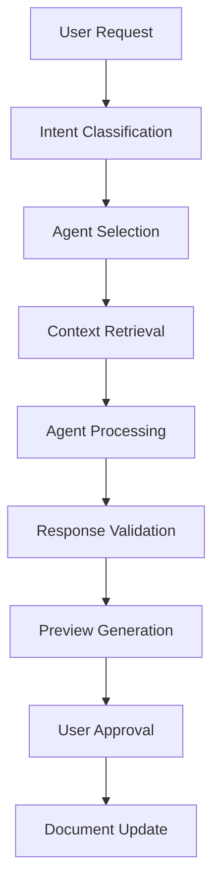

# Centrid.ai AI Agent Execution System - Implementation PRD

**Version**: 4.0 (MVP Aligned - Claude Sonnet Only + Templates)  
**Date**: 2024-01-15  
**Status**: Ready for Implementation  
**Estimated Time**: 40 hours (Weeks 2-3)  
**Priority**: Core Innovation - Product Differentiator  
**Dependencies**: Document Processing (02-document-processing.md), Backend (01-backend-architecture.md)  
**Key Changes**: Claude Sonnet only, template system, full-text search context (no vectors), selected/relevant documents

---

## 🎯 **OVERVIEW**

### **Objective (MVP)**

Build AI agents using **Claude Sonnet** (single model) with context from selected or relevant documents via PostgreSQL full-text search, with real-time progress updates via WebSocket/SSE.

### **Success Criteria (MVP)**

- AI agents use selected/relevant documents as context via full-text search (no vector search)
- Create agent generates complete documents with template support
- Edit agent makes contextually appropriate modifications with real-time progress
- Research agent synthesizes insights across multiple documents using text search
- **Quality Target**: 85% user approval rate on first try
- **Performance Target**: <10 second response time for agent requests
- **Real-time Updates**: Live progress updates via WebSocket/SSE
- **Model**: Claude Sonnet ONLY for all operations

---

## 🤖 **AI AGENT ARCHITECTURE**

### **Core Agent Framework**



### **Agent Types & Capabilities**

**Create Agent**: Generates new content using knowledge base patterns
**Edit Agent**: Modifies existing content with contextual awareness  
**Research Agent**: Synthesizes information across documents
**Code Agent**: Specialized for technical documentation and code analysis (Future)
**Summary Agent**: Creates summaries and abstracts (Future)

---

## 📋 **IMPLEMENTATION REQUIREMENTS**

### **Phase 1: Enhanced Agent Engine (Week 4 - 20 hours)**

#### **1.1 Type-Safe Request Processing (6 hours)**

**Enhanced Request Classification with Zod**:

```typescript
// lib/agents/validation.ts
import { z } from "zod";

export const AgentRequestSchema = z.object({
  id: z.string().uuid(),
  userId: z.string().uuid(),
  content: z.string().min(1).max(5000),
  agentType: z.enum(["create", "edit", "research", "auto"]),
  targetLocation: z.string().optional(),
  context: z.record(z.any()).optional(),
  preferences: z
    .object({
      model: z
        .enum(["auto", "gpt-4o", "gpt-4o-mini", "claude-3-5-sonnet"])
        .optional(),
      style: z.enum(["balanced", "concise", "detailed", "creative"]).optional(),
      temperature: z.number().min(0).max(2).optional(),
    })
    .optional(),
  timestamp: z.date(),
});

export type AgentRequest = z.infer<typeof AgentRequestSchema>;
```

**Intent Classification System**:

```typescript
interface AgentRequest {
  id: string;
  userId: string;
  content: string;
  targetLocation?: string; // document ID or new file
  context?: Record<string, any>;
  preferences?: UserPreferences;
  timestamp: Date;
}

interface ClassificationResult {
  agentType: "create" | "edit" | "research";
  confidence: number;
  complexity: "simple" | "medium" | "complex";
  estimatedTokens: number;
  suggestedModel: AIModel;
}

class RequestClassifier {
  async classifyRequest(request: AgentRequest): Promise<ClassificationResult> {
    // Analyze request patterns
    const patterns = await this.analyzePatterns(request.content);

    // Determine intent
    const intent = this.determineIntent(patterns);

    // Assess complexity
    const complexity = this.assessComplexity(request.content);

    // Select optimal model
    const model = this.selectModel(intent, complexity);

    return {
      agentType: intent,
      confidence: patterns.confidence,
      complexity,
      estimatedTokens: await this.estimateTokenUsage(request),
      suggestedModel: model,
    };
  }

  private determineIntent(
    patterns: RequestPatterns
  ): "create" | "edit" | "research" {
    const indicators = {
      create: ["write", "create", "generate", "new", "document", "draft"],
      edit: ["edit", "modify", "change", "update", "improve", "rewrite"],
      research: ["find", "search", "analyze", "summarize", "what", "explain"],
    };

    // Calculate confidence scores for each intent
    const scores = Object.entries(indicators).map(([intent, words]) => {
      const matches = words.filter((word) =>
        patterns.normalizedText.includes(word)
      ).length;
      return { intent, score: matches / words.length };
    });

    // Return highest scoring intent
    return scores.reduce((a, b) => (a.score > b.score ? a : b)).intent as any;
  }

  private selectModel(intent: string, complexity: string): AIModel {
    const modelMatrix = {
      create: {
        simple: "gpt-4o-mini",
        medium: "gpt-4o",
        complex: "claude-3-5-sonnet",
      },
      edit: {
        simple: "gpt-4o-mini",
        medium: "claude-3-5-sonnet",
        complex: "claude-3-5-sonnet",
      },
      research: {
        simple: "gpt-4o",
        medium: "claude-3-5-sonnet",
        complex: "claude-3-5-sonnet",
      },
    };

    return modelMatrix[intent][complexity];
  }
}
```

**Agent Router Implementation**:

```typescript
class AgentRouter {
  private agents: Map<string, BaseAgent> = new Map();

  constructor() {
    this.agents.set("create", new CreateAgent());
    this.agents.set("edit", new EditAgent());
    this.agents.set("research", new ResearchAgent());
  }

  async routeRequest(request: AgentRequest): Promise<AgentResponse> {
    // Classify request
    const classification = await this.classifier.classifyRequest(request);

    // Get appropriate agent
    const agent = this.agents.get(classification.agentType);
    if (!agent) {
      throw new Error(`Agent not found: ${classification.agentType}`);
    }

    // Execute with tracking
    const startTime = Date.now();
    try {
      const response = await agent.execute(request, classification);

      // Track success metrics
      await this.trackExecution({
        requestId: request.id,
        agentType: classification.agentType,
        executionTime: Date.now() - startTime,
        success: true,
        tokensUsed: response.tokensUsed,
        cost: response.cost,
      });

      return response;
    } catch (error) {
      // Track failure
      await this.trackExecution({
        requestId: request.id,
        agentType: classification.agentType,
        executionTime: Date.now() - startTime,
        success: false,
        error: error.message,
      });
      throw error;
    }
  }
}
```

**Deliverable**: Intelligent request routing with performance tracking

#### **1.2 Enhanced Context Retrieval (8 hours)**

**postgres.js Vector Search Integration**:

```typescript
// lib/agents/context.ts
import postgres from "postgres";
import { supabase } from "../supabase";
import { ContextChunkSchema } from "../validation";

export class ContextBuilder {
  private sql = postgres(process.env.DATABASE_URL!, {
    types: {
      vector: {
        to: 1184,
        from: [1184],
        serialize: (x: number[]) => `[${x.join(",")}]`,
        parse: (x: string) => x.slice(1, -1).split(",").map(Number),
      },
    },
  });

  async buildContext(request: ContextRequest): Promise<RetrievedContext> {
    // Fast vector similarity search with complex filters
    const chunks = await this.sql<ContextChunk[]>`
      SELECT 
        c.id,
        c.content,
        c.section_hierarchy,
        d.filename as document_name,
        1 - (e.embedding <=> ${request.queryVector}) as similarity
      FROM document_chunks c
      JOIN documents d ON d.id = c.document_id
      JOIN embeddings e ON e.chunk_id = c.id
      WHERE d.user_id = ${request.userId}
        AND d.processing_status = 'completed'
        AND 1 - (e.embedding <=> ${request.queryVector}) > 0.7
      ORDER BY similarity DESC
      LIMIT ${Math.min(request.maxChunks, 20)}
    `;

    // Runtime validation ensures data integrity
    const validatedChunks = chunks.map((chunk) =>
      ContextChunkSchema.parse(chunk)
    );

    // Get user patterns with standard Supabase query
    const patterns = await this.getUserPatterns(request.userId);

    return {
      relevantChunks: validatedChunks,
      userPatterns: patterns,
      confidence: this.calculateConfidence(validatedChunks),
      totalTokens: this.calculateTokens(validatedChunks, patterns),
    };
  }
}
```

**Context Builder Implementation**:

```typescript
interface ContextRequest {
  userId: string;
  query: string;
  agentType: string;
  maxTokens: number;
  includePatterns: boolean;
  includeHistory: boolean;
}

interface RetrievedContext {
  relevantChunks: ContextChunk[];
  userPatterns: UserPatterns;
  recentHistory: AgentHistory[];
  totalTokens: number;
  confidence: number;
}

class ContextBuilder {
  async buildContext(request: ContextRequest): Promise<RetrievedContext> {
    // Get relevant chunks via vector search
    const chunks = await this.retrieveRelevantChunks(
      request.userId,
      request.query,
      request.maxTokens * 0.7 // Leave room for patterns and history
    );

    // Get user writing patterns
    const patterns = request.includePatterns
      ? await this.getUserPatterns(request.userId, request.agentType)
      : null;

    // Get recent agent history for continuity
    const history = request.includeHistory
      ? await this.getRecentHistory(request.userId, 5)
      : [];

    // Optimize context for token limits
    const optimizedContext = await this.optimizeContext({
      chunks,
      patterns,
      history,
      maxTokens: request.maxTokens,
    });

    return optimizedContext;
  }

  private async retrieveRelevantChunks(
    userId: string,
    query: string,
    maxTokens: number
  ): Promise<ContextChunk[]> {
    // Generate query embedding
    const queryEmbedding = await this.embeddingService.generateQueryEmbedding(
      query
    );

    // Search for similar chunks
    const searchResults = await this.vectorStore.searchSimilar(
      queryEmbedding,
      20, // Get more than needed for ranking
      0.7, // Minimum relevance threshold
      userId
    );

    // Rank and select best chunks within token limit
    return this.selectOptimalChunks(searchResults, maxTokens);
  }

  private async getUserPatterns(
    userId: string,
    agentType: string
  ): Promise<UserPatterns> {
    // Analyze user's previous content
    const userDocuments = await this.documentService.getUserDocuments(
      userId,
      10
    );

    // Extract writing patterns
    const patterns = {
      writingStyle: await this.analyzeWritingStyle(userDocuments),
      commonStructures: await this.extractStructures(userDocuments),
      terminology: await this.extractTerminology(userDocuments),
      codeStyle:
        agentType === "create"
          ? await this.analyzeCodeStyle(userDocuments)
          : null,
    };

    return patterns;
  }

  private selectOptimalChunks(
    chunks: SearchResult[],
    maxTokens: number
  ): ContextChunk[] {
    // Sort by relevance score
    chunks.sort((a, b) => b.similarity - a.similarity);

    const selected: ContextChunk[] = [];
    let tokenCount = 0;

    for (const chunk of chunks) {
      const chunkTokens = chunk.tokenCount + 50; // Buffer for formatting

      if (tokenCount + chunkTokens <= maxTokens) {
        selected.push(chunk);
        tokenCount += chunkTokens;
      } else {
        break;
      }
    }

    return selected;
  }
}
```

**Context Optimization**:

```typescript
class ContextOptimizer {
  async optimizeContext(context: RawContext): Promise<RetrievedContext> {
    // Remove redundant information
    const deduplicatedChunks = this.deduplicateContent(context.chunks);

    // Prioritize by relevance and recency
    const prioritizedChunks = this.prioritizeChunks(deduplicatedChunks);

    // Compress verbose content while preserving meaning
    const compressedChunks = await this.compressChunks(prioritizedChunks);

    // Ensure token limit compliance
    const finalChunks = this.enforceTokenLimit(
      compressedChunks,
      context.maxTokens
    );

    return {
      relevantChunks: finalChunks,
      userPatterns: context.patterns,
      recentHistory: context.history,
      totalTokens: this.calculateTotalTokens(
        finalChunks,
        context.patterns,
        context.history
      ),
      confidence: this.calculateConfidence(finalChunks),
    };
  }

  private deduplicateContent(chunks: ContextChunk[]): ContextChunk[] {
    const seen = new Set<string>();
    return chunks.filter((chunk) => {
      const hash = this.generateContentHash(chunk.content);
      if (seen.has(hash)) return false;
      seen.add(hash);
      return true;
    });
  }
}
```

**Deliverable**: Intelligent context retrieval with user pattern recognition

#### **1.3 Claude Sonnet Integration (4 hours - MVP Simplified)**

**Single Model Service**:

```typescript
interface ModelRequest {
  prompt: string;
  maxTokens?: number;
  temperature?: number;
  systemPrompt?: string;
}

interface ModelResponse {
  content: string;
  tokensUsed: number;
  cost: number;
  finishReason: string;
  model: string;
}

class ClaudeService {
  private anthropic: Anthropic;

  constructor() {
    this.anthropic = new Anthropic({
      apiKey: process.env.ANTHROPIC_API_KEY,
    });
  }

  async generateResponse(request: ModelRequest): Promise<ModelResponse> {
    const provider = this.providers.get(request.model.provider);
    if (!provider) {
      throw new Error(`Provider not supported: ${request.model.provider}`);
    }

    // Add retry logic with exponential backoff
    return await this.withRetry(() => provider.generateResponse(request), 3);
  }

  private async withRetry<T>(
    fn: () => Promise<T>,
    maxRetries: number
  ): Promise<T> {
    let lastError: Error;

    for (let attempt = 1; attempt <= maxRetries; attempt++) {
      try {
        return await fn();
      } catch (error) {
        lastError = error;

        if (attempt === maxRetries) break;

        // Exponential backoff: 1s, 2s, 4s
        const delay = Math.pow(2, attempt - 1) * 1000;
        await this.wait(delay);
      }
    }

    throw lastError;
  }
}

class OpenAIProvider implements AIProvider {
  async generateResponse(request: ModelRequest): Promise<ModelResponse> {
    const response = await this.openai.chat.completions.create({
      model: request.model.name,
      messages: [
        { role: "system", content: request.systemPrompt || "" },
        { role: "user", content: request.prompt },
      ],
      max_tokens: request.maxTokens,
      temperature: request.temperature || 0.7,
    });

    return {
      content: response.choices[0].message.content,
      tokensUsed: response.usage.total_tokens,
      cost: this.calculateCost(response.usage.total_tokens, request.model),
      finishReason: response.choices[0].finish_reason,
      model: request.model.name,
    };
  }
}

class AnthropicProvider implements AIProvider {
  async generateResponse(request: ModelRequest): Promise<ModelResponse> {
    const response = await this.anthropic.messages.create({
      model: request.model.name,
      max_tokens: request.maxTokens || 2000,
      system: request.systemPrompt,
      messages: [{ role: "user", content: request.prompt }],
      temperature: request.temperature || 0.7,
    });

    return {
      content: response.content[0].text,
      tokensUsed: response.usage.input_tokens + response.usage.output_tokens,
      cost: this.calculateCost(
        response.usage.input_tokens + response.usage.output_tokens,
        request.model
      ),
      finishReason: response.stop_reason,
      model: request.model.name,
    };
  }
}
```

**Model Selection Logic**:

```typescript
class ModelSelector {
  selectOptimalModel(
    request: AgentRequest,
    classification: ClassificationResult
  ): AIModel {
    const models: Record<string, AIModel> = {
      "gpt-4o-mini": {
        name: "gpt-4o-mini",
        provider: "openai",
        maxTokens: 16384,
        costPer1kTokens: 0.00015,
        strengths: ["speed", "cost", "simple tasks"],
      },
      "gpt-4o": {
        name: "gpt-4o",
        provider: "openai",
        maxTokens: 128000,
        costPer1kTokens: 0.005,
        strengths: ["general purpose", "coding", "analysis"],
      },
      "claude-3-5-sonnet": {
        name: "claude-3-5-sonnet-20240620",
        provider: "anthropic",
        maxTokens: 200000,
        costPer1kTokens: 0.003,
        strengths: ["writing", "analysis", "complex reasoning"],
      },
    };

    // Apply selection logic based on task requirements
    if (
      classification.complexity === "simple" &&
      classification.estimatedTokens < 5000
    ) {
      return models["gpt-4o-mini"];
    }

    if (
      classification.agentType === "edit" ||
      classification.agentType === "research"
    ) {
      return models["claude-3-5-sonnet"];
    }

    if (classification.estimatedTokens > 50000) {
      return models["claude-3-5-sonnet"];
    }

    return models["gpt-4o"];
  }
}
```

**Deliverable**: Multi-model integration with intelligent selection

### **Phase 2: Real-time Agent Execution (Week 5 - 22 hours)**

#### **2.1 Valtio Real-time Progress Integration (6 hours)**

**Real-time Agent State Management**:

```typescript
// lib/agents/state.ts
import { proxy } from "valtio";
import { supabase } from "../supabase";

export const agentState = proxy({
  activeRequests: new Map<string, AgentRequest>(),
  progress: new Map<string, AgentProgress>(),
  results: new Map<string, AgentResponse>(),
});

// Real-time progress updates
export const useAgentProgress = (requestId: string) => {
  useEffect(() => {
    const channel = supabase
      .channel(`agent_progress:${requestId}`)
      .on(
        "postgres_changes",
        {
          event: "UPDATE",
          schema: "public",
          table: "agent_requests",
          filter: `id=eq.${requestId}`,
        },
        (payload) => {
          const progress = AgentProgressSchema.parse(payload.new);
          agentState.progress.set(requestId, progress);
        }
      )
      .subscribe();

    return () => supabase.removeChannel(channel);
  }, [requestId]);
};
```

#### **2.1 Create Agent with Template System (12 hours - MVP)**

**Template System**:

```typescript
interface DocumentTemplate {
  id: string;
  name: string;
  description: string;
  category: string;
  structure: string;
  placeholders: string[];
}

const TEMPLATES: DocumentTemplate[] = [
  {
    id: "api-docs",
    name: "API Documentation",
    description: "Technical API documentation template",
    category: "technical",
    structure:
      "# API Title\n\n## Overview\n\n## Endpoints\n\n### GET /resource\n\n## Authentication\n\n## Examples",
    placeholders: ["API_NAME", "ENDPOINT", "DESCRIPTION"],
  },
  {
    id: "blog-post",
    name: "Blog Post",
    description: "Blog post template",
    category: "content",
    structure: "# Title\n\n## Introduction\n\n## Main Content\n\n## Conclusion",
    placeholders: ["TOPIC", "KEY_POINTS"],
  },
  {
    id: "meeting-notes",
    name: "Meeting Notes",
    description: "Meeting notes template",
    category: "notes",
    structure:
      "# Meeting: [Title]\n\n**Date**: \n**Attendees**: \n\n## Agenda\n\n## Discussion\n\n## Action Items\n\n## Next Steps",
    placeholders: ["TITLE", "DATE", "ATTENDEES"],
  },
];
```

**Create Agent Core Logic (MVP)**:

````typescript
class CreateAgent extends BaseAgent {
  async execute(request: AgentRequest): Promise<AgentResponse> {
    // Check if template requested
    const template = this.detectTemplate(request.content);

    // Build context from selected or relevant documents
    const context = await this.contextBuilder.buildContext({
      userId: request.userId,
      query: request.content,
      agentType: "create",
      maxTokens: 6000,
    });

    // Generate system prompt
    const systemPrompt = template
      ? this.buildTemplateSystemPrompt(template, context)
      : this.buildCreateSystemPrompt(context);

    // Create user prompt
    const userPrompt = this.buildCreateUserPrompt(request, context, template);

    // Generate content using Claude Sonnet ONLY
    const response = await this.claudeService.generateResponse({
      prompt: userPrompt,
      systemPrompt,
      temperature: 0.7,
      maxTokens: 3000,
    });

    // Validate and format response
    const validatedContent = await this.validateCreateResponse(
      response.content,
      context
    );

    // Generate preview with metadata
    return this.generatePreview({
      content: validatedContent,
      sourceContext: context.relevantChunks,
      confidence: this.calculateConfidence(validatedContent, context),
      tokensUsed: response.tokensUsed,
      cost: response.cost,
      model: response.model,
    });
  }

  private buildCreateSystemPrompt(context: RetrievedContext): string {
    return `You are a specialized content creation agent with deep understanding of the user's knowledge base and writing style.

CONTEXT ABOUT USER:
${
  context.userPatterns
    ? this.formatUserPatterns(context.userPatterns)
    : "No specific patterns available"
}

KNOWLEDGE BASE CONTEXT:
${context.relevantChunks.map((chunk) => this.formatChunk(chunk)).join("\n\n")}

RECENT AGENT HISTORY:
${context.recentHistory.map((h) => this.formatHistory(h)).join("\n")}

INSTRUCTIONS:
1. Create content that matches the user's established writing style and patterns
2. Use information from the knowledge base to ensure consistency and accuracy
3. Reference existing concepts and terminology from their documents
4. Maintain the same level of technical depth as their existing content
5. Structure content using their preferred document organization patterns
6. Generate complete, well-formatted content ready for immediate use

OUTPUT FORMAT:
- Provide clean, formatted content without meta-commentary
- Use appropriate markdown formatting when applicable
- Include relevant code examples if the user typically includes them
- Follow their established section structure and naming conventions`;
  }

  private buildCreateUserPrompt(
    request: AgentRequest,
    context: RetrievedContext
  ): string {
    let prompt = `CREATE REQUEST: ${request.content}\n\n`;

    if (request.targetLocation) {
      prompt += `TARGET LOCATION: ${request.targetLocation}\n\n`;
    }

    if (context.relevantChunks.length > 0) {
      prompt += `Based on your knowledge base context above, create content that:\n`;
      prompt += `- Builds upon existing information and concepts\n`;
      prompt += `- Maintains consistency with established terminology\n`;
      prompt += `- References relevant existing work when appropriate\n`;
      prompt += `- Follows established structural patterns\n\n`;
    }

    prompt += `Generate the requested content now:`;

    return prompt;
  }

  private async validateCreateResponse(
    content: string,
    context: RetrievedContext
  ): Promise<string> {
    // Check for common issues
    const issues = [];

    // Validate length
    if (content.length < 100) {
      issues.push("Content too short");
    }

    // Check for proper formatting
    if (content.includes("```") && !this.hasValidCodeBlocks(content)) {
      issues.push("Invalid code block formatting");
    }

    // Validate structure
    if (
      context.userPatterns?.commonStructures &&
      !this.matchesUserStructure(content, context.userPatterns)
    ) {
      // Could auto-fix structure here
    }

    // If significant issues, could retry with modified prompt
    if (issues.length > 2) {
      throw new Error(`Content quality issues: ${issues.join(", ")}`);
    }

    return content;
  }
}
````

**Content Quality Assessment**:

```typescript
interface ContentQuality {
  relevanceScore: number; // 0-1
  styleConsistency: number; // 0-1
  completeness: number; // 0-1
  technicalAccuracy: number; // 0-1
  overallScore: number; // 0-1
}

class ContentQualityAnalyzer {
  async assessContent(
    content: string,
    context: RetrievedContext
  ): Promise<ContentQuality> {
    const relevance = await this.assessRelevance(
      content,
      context.relevantChunks
    );
    const styleConsistency = this.assessStyleConsistency(
      content,
      context.userPatterns
    );
    const completeness = this.assessCompleteness(content);
    const technicalAccuracy = await this.assessTechnicalAccuracy(
      content,
      context
    );

    return {
      relevanceScore: relevance,
      styleConsistency,
      completeness,
      technicalAccuracy,
      overallScore:
        (relevance + styleConsistency + completeness + technicalAccuracy) / 4,
    };
  }

  private assessStyleConsistency(
    content: string,
    patterns: UserPatterns
  ): number {
    if (!patterns) return 0.7; // Default score when no patterns available

    let score = 0;
    let checks = 0;

    // Check writing style consistency
    if (patterns.writingStyle) {
      score += this.compareWritingStyle(content, patterns.writingStyle);
      checks++;
    }

    // Check structure consistency
    if (patterns.commonStructures) {
      score += this.compareStructure(content, patterns.commonStructures);
      checks++;
    }

    // Check terminology usage
    if (patterns.terminology) {
      score += this.checkTerminologyUsage(content, patterns.terminology);
      checks++;
    }

    return checks > 0 ? score / checks : 0.7;
  }
}
```

**Deliverable**: High-quality content creation agent with style matching

#### **2.2 Edit Agent Implementation (8 hours)**

**Edit Agent Logic**:

````typescript
class EditAgent extends BaseAgent {
  async execute(
    request: AgentRequest,
    classification: ClassificationResult
  ): Promise<AgentResponse> {
    // Parse edit request for target text and instructions
    const editRequest = await this.parseEditRequest(request);

    // Build context around target text
    const context = await this.buildEditContext(editRequest, request.userId);

    // Generate edit options
    const editOptions = await this.generateEditOptions(editRequest, context);

    // Validate and rank options
    const rankedOptions = await this.rankEditOptions(editOptions, context);

    // Return best option with alternatives
    return this.generateEditPreview(
      rankedOptions[0],
      rankedOptions.slice(1, 3)
    );
  }

  private async parseEditRequest(request: AgentRequest): Promise<EditRequest> {
    // Extract target text and edit instructions
    const patterns = {
      selection: /```selection\n(.*?)\n```/s,
      instruction: /```instruction\n(.*?)\n```/s,
      // Alternative patterns for different input formats
    };

    // Try to parse structured request
    for (const [type, pattern] of Object.entries(patterns)) {
      const match = request.content.match(pattern);
      if (match) {
        return this.parseStructuredRequest(request.content, match);
      }
    }

    // Fallback to natural language parsing
    return this.parseNaturalRequest(request.content);
  }

  private async generateEditOptions(
    editRequest: EditRequest,
    context: EditContext
  ): Promise<EditOption[]> {
    const options: EditOption[] = [];

    // Generate primary edit
    const primaryEdit = await this.generateEdit(
      editRequest,
      context,
      "primary"
    );
    options.push(primaryEdit);

    // Generate alternative approaches
    const conservativeEdit = await this.generateEdit(
      editRequest,
      context,
      "conservative"
    );
    const aggressiveEdit = await this.generateEdit(
      editRequest,
      context,
      "aggressive"
    );

    options.push(conservativeEdit, aggressiveEdit);

    return options;
  }

  private async generateEdit(
    request: EditRequest,
    context: EditContext,
    approach: string
  ): Promise<EditOption> {
    const systemPrompt = this.buildEditSystemPrompt(context, approach);
    const userPrompt = this.buildEditUserPrompt(request, context);

    const model = this.selectEditModel(request.complexity);
    const response = await this.modelService.generateResponse({
      prompt: userPrompt,
      systemPrompt,
      model,
      temperature: approach === "conservative" ? 0.3 : 0.7,
    });

    return {
      approach,
      originalText: request.targetText,
      editedText: response.content,
      explanation: this.generateEditExplanation(request, response.content),
      confidence: this.calculateEditConfidence(response.content, context),
      tokensUsed: response.tokensUsed,
      cost: response.cost,
    };
  }

  private buildEditSystemPrompt(
    context: EditContext,
    approach: string
  ): string {
    const approachInstructions = {
      primary:
        "Make focused improvements while preserving the core meaning and style",
      conservative:
        "Make minimal changes, focusing only on essential improvements",
      aggressive:
        "Make comprehensive improvements, potentially restructuring for clarity",
    };

    return `You are a specialized text editing agent with deep understanding of the user's writing style and document context.

EDITING APPROACH: ${approachInstructions[approach]}

DOCUMENT CONTEXT:
${
  context.surroundingText
    ? `Before: ${context.surroundingText.before}\n\nAfter: ${context.surroundingText.after}`
    : "No surrounding context available"
}

USER WRITING PATTERNS:
${
  context.userPatterns
    ? this.formatUserPatterns(context.userPatterns)
    : "No specific patterns identified"
}

RELATED CONTENT FROM KNOWLEDGE BASE:
${context.relatedContent.map((chunk) => this.formatChunk(chunk)).join("\n\n")}

EDITING GUIDELINES:
1. Maintain consistency with user's established writing style
2. Preserve document flow and structure  
3. Keep the same level of technical detail
4. Use terminology consistent with their knowledge base
5. Respect the document's purpose and audience
6. Focus on the specific requested changes
7. Provide only the edited text without commentary`;
  }
}
````

**Edit Quality Assessment**:

```typescript
class EditQualityAnalyzer {
  assessEdit(
    original: string,
    edited: string,
    context: EditContext
  ): EditQuality {
    return {
      preservedMeaning: this.assessMeaningPreservation(original, edited),
      styleConsistency: this.assessStyleMaintenance(
        edited,
        context.userPatterns
      ),
      improvementQuality: this.assessImprovement(original, edited),
      contextFit: this.assessContextualFit(edited, context.surroundingText),
      overallScore: 0, // calculated from above
    };
  }

  private assessImprovement(original: string, edited: string): number {
    // Compare readability scores
    const originalReadability = this.calculateReadability(original);
    const editedReadability = this.calculateReadability(edited);

    // Compare clarity and conciseness
    const clarityImprovement = this.assessClarityImprovement(original, edited);

    // Check for grammar and style improvements
    const grammarImprovement = this.assessGrammarImprovement(original, edited);

    return (
      Math.max(0, editedReadability - originalReadability) * 0.4 +
      clarityImprovement * 0.4 +
      grammarImprovement * 0.2
    );
  }
}
```

**Deliverable**: Context-aware editing agent with quality assessment

#### **2.3 Research Agent Implementation (7 hours)**

**Research Agent Core Logic**:

```typescript
class ResearchAgent extends BaseAgent {
  async execute(
    request: AgentRequest,
    classification: ClassificationResult
  ): Promise<AgentResponse> {
    // Parse research query
    const researchQuery = this.parseResearchQuery(request.content);

    // Plan research strategy
    const strategy = await this.planResearchStrategy(
      researchQuery,
      request.userId
    );

    // Execute multi-step research
    const findings = await this.conductResearch(strategy, request.userId);

    // Synthesize results
    const synthesis = await this.synthesizeFindings(findings, researchQuery);

    // Generate structured report
    return this.generateResearchReport(synthesis, findings);
  }

  private async planResearchStrategy(
    query: ResearchQuery,
    userId: string
  ): Promise<ResearchStrategy> {
    // Analyze query complexity and scope
    const complexity = this.assessQueryComplexity(query);

    // Determine research approach
    const approaches = [];

    if (query.type === "factual") {
      approaches.push("direct_search", "cross_reference");
    } else if (query.type === "analytical") {
      approaches.push("pattern_analysis", "synthesis", "comparison");
    } else if (query.type === "comprehensive") {
      approaches.push(
        "broad_search",
        "categorization",
        "synthesis",
        "gap_analysis"
      );
    }

    return {
      query,
      approaches,
      searchQueries: await this.generateSearchQueries(query),
      expectedDepth: complexity > 0.7 ? "deep" : "moderate",
      estimatedChunks: complexity * 30 + 10, // Rough estimate
    };
  }

  private async conductResearch(
    strategy: ResearchStrategy,
    userId: string
  ): Promise<ResearchFindings> {
    const allFindings: SearchResult[] = [];

    // Execute multiple search queries
    for (const searchQuery of strategy.searchQueries) {
      const queryEmbedding = await this.embeddingService.generateQueryEmbedding(
        searchQuery
      );

      const results = await this.vectorStore.searchSimilar(
        queryEmbedding,
        20, // Get more results for comprehensive research
        0.6, // Lower threshold for broader coverage
        userId
      );

      allFindings.push(...results);
    }

    // Deduplicate and rank findings
    const uniqueFindings = this.deduplicateFindings(allFindings);
    const rankedFindings = this.rankFindingsByRelevance(
      uniqueFindings,
      strategy.query
    );

    // Group findings by themes/topics
    const groupedFindings = await this.groupFindingsByTheme(rankedFindings);

    return {
      totalFindings: uniqueFindings.length,
      relevantFindings: rankedFindings.slice(
        0,
        strategy.expectedDepth === "deep" ? 30 : 20
      ),
      groupedByTheme: groupedFindings,
      coverage: this.assessCoverage(rankedFindings, strategy.query),
      confidence: this.calculateResearchConfidence(rankedFindings),
    };
  }

  private async synthesizeFindings(
    findings: ResearchFindings,
    query: ResearchQuery
  ): Promise<ResearchSynthesis> {
    // Prepare context for synthesis
    const context = this.prepareResearchContext(findings);

    // Generate synthesis prompt
    const systemPrompt = this.buildResearchSystemPrompt(query, findings);
    const userPrompt = this.buildResearchUserPrompt(query, context);

    // Use advanced model for complex synthesis
    const model = this.selectResearchModel(
      findings.totalFindings,
      query.complexity
    );

    const response = await this.modelService.generateResponse({
      prompt: userPrompt,
      systemPrompt,
      model,
      temperature: 0.5, // Balance creativity with accuracy
      maxTokens: 4000,
    });

    // Structure the synthesis
    return this.structureSynthesis(response.content, findings, query);
  }

  private buildResearchSystemPrompt(
    query: ResearchQuery,
    findings: ResearchFindings
  ): string {
    return `You are a specialized research synthesis agent with access to the user's complete knowledge base.

RESEARCH QUERY: ${query.original}
QUERY TYPE: ${query.type}
COMPLEXITY: ${query.complexity}

RESEARCH FINDINGS SUMMARY:
- Total relevant sources: ${findings.relevantFindings.length}
- Themes identified: ${Object.keys(findings.groupedByTheme).join(", ")}
- Coverage assessment: ${findings.coverage}
- Confidence level: ${findings.confidence}

SYNTHESIS INSTRUCTIONS:
1. Provide a comprehensive analysis based on the available information
2. Identify patterns, themes, and relationships across sources
3. Highlight any conflicting information with source attribution
4. Note gaps where information is limited or unavailable
5. Structure findings logically with clear conclusions
6. Include specific references to source documents
7. Suggest follow-up research directions if applicable

OUTPUT STRUCTURE:
## Executive Summary
[Key findings in 2-3 sentences]

## Main Findings
[Detailed analysis organized by themes]

## Patterns and Insights
[Cross-cutting insights and relationships]

## Gaps and Limitations
[What information is missing or unclear]

## Sources
[List of referenced documents with relevance scores]

## Suggested Follow-up
[Recommended additional research questions]`;
  }
}
```

**Research Quality Metrics**:

```typescript
interface ResearchQuality {
  comprehensiveness: number; // 0-1
  accuracy: number; // 0-1
  sourceReliability: number; // 0-1
  synthesisQuality: number; // 0-1
  actionability: number; // 0-1
}

class ResearchQualityAnalyzer {
  assessResearchQuality(
    synthesis: ResearchSynthesis,
    findings: ResearchFindings
  ): ResearchQuality {
    return {
      comprehensiveness: this.assessComprehensiveness(synthesis, findings),
      accuracy: this.assessAccuracy(synthesis, findings),
      sourceReliability: this.assessSourceReliability(findings),
      synthesisQuality: this.assessSynthesisQuality(synthesis),
      actionability: this.assessActionability(synthesis),
    };
  }

  private assessComprehensiveness(
    synthesis: ResearchSynthesis,
    findings: ResearchFindings
  ): number {
    // Check coverage of identified themes
    const themeCoverage =
      Object.keys(findings.groupedByTheme).filter((theme) =>
        synthesis.content.toLowerCase().includes(theme.toLowerCase())
      ).length / Object.keys(findings.groupedByTheme).length;

    // Check citation coverage
    const citationCoverage =
      synthesis.citedSources.length /
      Math.min(findings.relevantFindings.length, 15);

    return themeCoverage * 0.6 + citationCoverage * 0.4;
  }
}
```

**Deliverable**: Comprehensive research agent with multi-source synthesis

### **Phase 3: Agent Integration & Quality System (Week 6 - 20 hours)**

#### **3.1 Response Validation & Quality Control (8 hours)**

**Quality Control System**:

```typescript
interface QualityGate {
  name: string;
  check: (response: AgentResponse) => Promise<QualityResult>;
  required: boolean;
  weight: number;
}

class AgentQualityController {
  private qualityGates: QualityGate[] = [
    {
      name: "content_length",
      check: this.checkContentLength.bind(this),
      required: true,
      weight: 0.1,
    },
    {
      name: "format_validity",
      check: this.checkFormatValidity.bind(this),
      required: true,
      weight: 0.2,
    },
    {
      name: "context_relevance",
      check: this.checkContextRelevance.bind(this),
      required: true,
      weight: 0.3,
    },
    {
      name: "style_consistency",
      check: this.checkStyleConsistency.bind(this),
      required: false,
      weight: 0.2,
    },
    {
      name: "factual_accuracy",
      check: this.checkFactualAccuracy.bind(this),
      required: false,
      weight: 0.2,
    },
  ];

  async validateResponse(response: AgentResponse): Promise<ValidationResult> {
    const results: QualityResult[] = [];

    // Run all quality gates
    for (const gate of this.qualityGates) {
      try {
        const result = await gate.check(response);
        results.push({ ...result, gate: gate.name, weight: gate.weight });
      } catch (error) {
        if (gate.required) {
          throw new Error(
            `Required quality gate failed: ${gate.name} - ${error.message}`
          );
        }
        results.push({
          gate: gate.name,
          passed: false,
          score: 0,
          issues: [error.message],
          weight: gate.weight,
        });
      }
    }

    // Calculate overall quality score
    const overallScore = this.calculateOverallScore(results);

    // Determine if response meets quality threshold
    const passed =
      overallScore >= 0.7 &&
      results
        .filter((r) => r.gate.endsWith("_required"))
        .every((r) => r.passed);

    return {
      passed,
      overallScore,
      results,
      recommendations: this.generateRecommendations(results),
    };
  }

  private async checkContextRelevance(
    response: AgentResponse
  ): Promise<QualityResult> {
    if (!response.sourceContext || response.sourceContext.length === 0) {
      return {
        passed: true,
        score: 0.8,
        issues: ["No source context to validate against"],
      };
    }

    // Check if response content relates to source chunks
    const relevanceScores = await Promise.all(
      response.sourceContext.map((chunk) =>
        this.calculateSemanticSimilarity(response.content, chunk.content)
      )
    );

    const avgRelevance =
      relevanceScores.reduce((a, b) => a + b, 0) / relevanceScores.length;

    return {
      passed: avgRelevance >= 0.6,
      score: avgRelevance,
      issues:
        avgRelevance < 0.6
          ? ["Generated content shows low relevance to source context"]
          : [],
    };
  }
}
```

**Automatic Quality Improvement**:

```typescript
class QualityImprover {
  async improveResponse(
    response: AgentResponse,
    validation: ValidationResult
  ): Promise<AgentResponse> {
    if (validation.overallScore >= 0.8) {
      return response; // Already high quality
    }

    // Identify specific issues to fix
    const issues = validation.results.filter((r) => !r.passed || r.score < 0.7);

    // Generate improvement strategy
    const improvementPlan = this.createImprovementPlan(issues);

    // Apply improvements
    let improvedResponse = response;

    for (const improvement of improvementPlan) {
      improvedResponse = await this.applyImprovement(
        improvedResponse,
        improvement
      );
    }

    // Validate improved response
    const newValidation = await this.qualityController.validateResponse(
      improvedResponse
    );

    // Return best version
    return newValidation.overallScore > validation.overallScore
      ? improvedResponse
      : response;
  }

  private createImprovementPlan(issues: QualityResult[]): Improvement[] {
    const plan: Improvement[] = [];

    for (const issue of issues) {
      switch (issue.gate) {
        case "format_validity":
          plan.push({ type: "reformat", priority: "high", details: issue });
          break;
        case "context_relevance":
          plan.push({
            type: "enhance_context",
            priority: "high",
            details: issue,
          });
          break;
        case "style_consistency":
          plan.push({
            type: "adjust_style",
            priority: "medium",
            details: issue,
          });
          break;
      }
    }

    return plan.sort(
      (a, b) =>
        this.priorityWeight(b.priority) - this.priorityWeight(a.priority)
    );
  }
}
```

**Deliverable**: Comprehensive quality control with automatic improvement

#### **3.2 Preview Generation System (6 hours)**

**Preview System Implementation**:

```typescript
interface AgentPreview {
  agentType: string;
  originalRequest: string;
  generatedContent: string;
  confidence: number;
  sourceAttribution: SourceReference[];
  suggestedChanges?: AlternativeOption[];
  metadata: PreviewMetadata;
}

class PreviewGenerator {
  async generatePreview(
    response: AgentResponse,
    request: AgentRequest
  ): Promise<AgentPreview> {
    // Generate diff if editing existing content
    const diff = request.targetLocation
      ? await this.generateDiff(request, response)
      : null;

    // Create source attribution
    const attribution = this.createSourceAttribution(response.sourceContext);

    // Generate alternative options
    const alternatives = await this.generateAlternatives(response, request);

    // Calculate confidence score
    const confidence = this.calculatePreviewConfidence(response);

    return {
      agentType: response.agentType,
      originalRequest: request.content,
      generatedContent: response.content,
      confidence,
      sourceAttribution: attribution,
      suggestedChanges: alternatives,
      diff,
      metadata: {
        tokensUsed: response.tokensUsed,
        cost: response.cost,
        model: response.model,
        processingTime: response.processingTime,
        qualityScore: response.qualityScore,
      },
    };
  }

  private async generateDiff(
    request: AgentRequest,
    response: AgentResponse
  ): Promise<ContentDiff> {
    // Get current content if editing
    const currentContent = await this.getCurrentContent(request.targetLocation);

    if (!currentContent) return null;

    // Generate unified diff
    const diff = this.createUnifiedDiff(currentContent, response.content);

    return {
      original: currentContent,
      modified: response.content,
      diff,
      changeStats: this.calculateChangeStats(diff),
      highlightedChanges: this.highlightChanges(
        currentContent,
        response.content
      ),
    };
  }

  private createSourceAttribution(
    sourceContext: ContextChunk[]
  ): SourceReference[] {
    return sourceContext.map((chunk) => ({
      documentId: chunk.documentId,
      documentName: chunk.documentName,
      chunkId: chunk.id,
      excerpt: this.createExcerpt(chunk.content, 100),
      relevanceScore: chunk.similarity,
      sectionHierarchy: chunk.sectionHierarchy,
    }));
  }

  private async generateAlternatives(
    response: AgentResponse,
    request: AgentRequest
  ): Promise<AlternativeOption[]> {
    // Generate 2-3 alternative approaches
    const alternatives: AlternativeOption[] = [];

    // Different tone/style
    alternatives.push(await this.generateAlternativeTone(response, "formal"));
    alternatives.push(await this.generateAlternativeTone(response, "concise"));

    // Different structure if applicable
    if (response.content.length > 500) {
      alternatives.push(
        await this.generateAlternativeStructure(response, "bullet_points")
      );
    }

    return alternatives.filter((alt) => alt !== null);
  }
}
```

**Mobile-Optimized Preview Interface**:

```typescript
interface MobilePreview {
  summary: string; // One-line summary for small screens
  keyChanges: string[]; // Bullet points of main changes
  swipeActions: SwipeAction[]; // Approve/reject gestures
  expandedView: boolean; // Full content on demand
}

class MobilePreviewOptimizer {
  optimizeForMobile(preview: AgentPreview): MobilePreview {
    return {
      summary: this.generateSummary(preview.generatedContent),
      keyChanges: this.extractKeyChanges(preview),
      swipeActions: [
        { direction: "right", action: "approve", color: "green" },
        { direction: "left", action: "reject", color: "red" },
        { direction: "up", action: "alternatives", color: "blue" },
      ],
      expandedView: false,
    };
  }

  private generateSummary(content: string): string {
    // Generate one-line summary for mobile
    const sentences = content.split(".").filter((s) => s.trim().length > 10);
    return sentences[0]?.trim() + "..." || "Content generated";
  }
}
```

**Deliverable**: Rich preview system optimized for mobile approval workflows

#### **3.3 Usage Tracking & Cost Management (6 hours)**

**Usage Tracking System**:

```typescript
interface UsageEvent {
  userId: string;
  agentType: string;
  requestId: string;
  tokensInput: number;
  tokensOutput: number;
  totalTokens: number;
  model: string;
  cost: number;
  success: boolean;
  processingTime: number;
  qualityScore?: number;
  timestamp: Date;
}

class UsageTracker {
  async trackAgentUsage(event: UsageEvent): Promise<void> {
    // Store usage event
    await this.database.insertUsageEvent(event);

    // Update user's current usage
    await this.updateUserUsage(event.userId, event);

    // Check quota limits
    await this.checkQuotaLimits(event.userId, event);

    // Update cost tracking
    await this.updateCostTracking(event.userId, event.cost);

    // Trigger alerts if needed
    await this.checkUsageAlerts(event.userId);
  }

  private async checkQuotaLimits(
    userId: string,
    event: UsageEvent
  ): Promise<void> {
    const user = await this.userService.getUser(userId);
    const currentUsage = await this.getUserCurrentUsage(userId);

    // Check request limits
    if (currentUsage.requests >= user.plan.maxRequests) {
      await this.notifyQuotaExceeded(userId, "requests");
      throw new QuotaExceededError("Monthly request limit reached");
    }

    // Check token limits
    if (currentUsage.tokens >= user.plan.maxTokens) {
      await this.notifyQuotaExceeded(userId, "tokens");
      throw new QuotaExceededError("Monthly token limit reached");
    }

    // Check cost limits (soft limit with warnings)
    if (currentUsage.cost >= user.plan.maxCost * 0.8) {
      await this.notifyApproachingLimit(userId, "cost");
    }
  }

  async getUserUsageAnalytics(
    userId: string,
    period: "day" | "week" | "month"
  ): Promise<UsageAnalytics> {
    const usage = await this.database.getUserUsage(userId, period);

    return {
      totalRequests: usage.length,
      totalTokens: usage.reduce((sum, u) => sum + u.totalTokens, 0),
      totalCost: usage.reduce((sum, u) => sum + u.cost, 0),
      avgResponseTime:
        usage.reduce((sum, u) => sum + u.processingTime, 0) / usage.length,
      agentBreakdown: this.calculateAgentBreakdown(usage),
      modelBreakdown: this.calculateModelBreakdown(usage),
      successRate: usage.filter((u) => u.success).length / usage.length,
      qualityScore: this.calculateAverageQuality(usage),
      projectedUsage: this.projectUsage(usage, period),
    };
  }
}
```

**Cost Optimization System**:

```typescript
class CostOptimizer {
  async optimizeRequest(
    request: AgentRequest,
    classification: ClassificationResult
  ): Promise<OptimizationPlan> {
    // Analyze request for cost optimization opportunities
    const opportunities = [];

    // Check if smaller model would suffice
    if (
      classification.complexity === "simple" &&
      classification.suggestedModel !== "gpt-4o-mini"
    ) {
      opportunities.push({
        type: "model_downgrade",
        description: "Use smaller model for simple request",
        savings: this.calculateModelSavings(
          classification.suggestedModel,
          "gpt-4o-mini"
        ),
        riskScore: 0.1,
      });
    }

    // Check for caching opportunities
    const similarRequests = await this.findSimilarRequests(request);
    if (similarRequests.length > 0) {
      opportunities.push({
        type: "response_caching",
        description: "Similar request processed recently",
        savings: classification.estimatedTokens * 0.8,
        riskScore: 0.2,
      });
    }

    // Check context optimization
    if (classification.estimatedTokens > 10000) {
      opportunities.push({
        type: "context_optimization",
        description: "Reduce context size for large requests",
        savings: classification.estimatedTokens * 0.3,
        riskScore: 0.3,
      });
    }

    return {
      originalCost: this.estimateCost(classification),
      opportunities,
      recommendedOptimizations: opportunities.filter((o) => o.riskScore < 0.25),
      potentialSavings: opportunities.reduce((sum, o) => sum + o.savings, 0),
    };
  }
}
```

**Deliverable**: Comprehensive usage tracking with cost optimization

---

## ✅ **IMPLEMENTATION CHECKLIST**

### **Week 4 Deliverables**

- [ ] Request classification and agent routing system
- [ ] Context retrieval with user pattern recognition
- [ ] Multi-model integration with OpenAI and Anthropic
- [ ] Basic agent execution framework
- [ ] Usage tracking and cost calculation
- [ ] Error handling and retry logic

### **Week 5 Deliverables**

- [ ] Create Agent with style-aware content generation
- [ ] Edit Agent with context-preserving modifications
- [ ] Research Agent with multi-source synthesis
- [ ] Content quality assessment systems
- [ ] Agent response validation and improvement
- [ ] Alternative generation for user choice

### **Week 6 Deliverables**

- [ ] Response validation with quality gates
- [ ] Preview generation system with diff visualization
- [ ] Mobile-optimized preview interfaces
- [ ] Usage analytics and quota management
- [ ] Cost optimization recommendations
- [ ] Performance monitoring and alerting

### **Quality Gates**

- [ ] 85% user approval rate on agent outputs
- [ ] <10 second average response time for agents
- [ ] > 90% agent request success rate
- [ ] Quality score >0.8 for generated content
- [ ] Cost per request <$0.05 for simple tasks, <$0.20 for complex
- [ ] Mobile preview interface loads in <2 seconds

---

## 📊 **SUCCESS METRICS**

### **Agent Performance**

- **Approval Rate**: 85%+ first-try approval from users
- **Response Time**: <10 seconds average across all agents
- **Quality Score**: >0.8 average quality rating
- **Success Rate**: >90% successful agent executions

### **User Experience**

- **Agent Adoption**: 70% of users try agents within first week
- **Usage Frequency**: Average 8 agent requests per user per week
- **Satisfaction**: 4.5+ stars for agent quality
- **Productivity**: Users report 3x faster content creation

### **Technical Performance**

- **System Reliability**: 99.5% uptime for agent system
- **Error Recovery**: <1% unrecoverable agent failures
- **Cost Efficiency**: <$0.10 average cost per successful request
- **Model Optimization**: 90% requests use optimal model selection

---

## 🚀 **SUPABASE PLUS AI AGENTS IMPLEMENTATION SUMMARY**

### **AI Architecture Enhancement - Edge Functions + Enhanced Tooling**

**This document has been updated to reflect Supabase Plus AI agent architecture. Key enhancements:**

#### **AI Processing Infrastructure**

- **From**: Vercel serverless functions with 5-minute timeout limits
- **To**: Supabase Edge Functions with unlimited execution time
- **Benefit**: Handle 15+ minute complex AI operations, global edge deployment

#### **Real-time Progress Updates**

- **From**: Polling-based progress updates every 2-5 seconds
- **To**: Supabase real-time subscriptions with sub-second updates
- **Benefit**: Live progress bars, better UX, 90% fewer API requests

#### **Context Retrieval System**

- **From**: Custom vector search API with separate caching layer
- **To**: Direct pgvector queries with built-in connection pooling
- **Benefit**: Faster context retrieval, reduced latency, simpler architecture

#### **Authentication & Security**

- **From**: Custom JWT validation middleware in each function
- **To**: Built-in Supabase Auth integration with RLS policies
- **Benefit**: Automatic user verification, database-level security

### **Edge Functions Implementation Strategy**

Instead of multiple API endpoints, implement these focused Edge Functions:

1. **`execute-create-agent`**: Content generation with knowledge base context
2. **`execute-edit-agent`**: Content modification with style preservation
3. **`execute-research-agent`**: Multi-document synthesis and analysis
4. **`agent-progress-update`**: Real-time progress broadcasting
5. **`validate-agent-response`**: Quality assessment and approval workflow

### **Performance & Scalability Improvements**

| Metric                    | Vercel Serverless      | Supabase Edge       | Improvement               |
| ------------------------- | ---------------------- | ------------------- | ------------------------- |
| **Max Execution Time**    | 5 minutes              | Unlimited           | No timeout limits         |
| **Cold Start**            | 100-300ms              | 50-100ms            | 50% faster                |
| **Global Distribution**   | Single region          | Worldwide edge      | Lower latency globally    |
| **Real-time Updates**     | Polling (2-5s delay)   | Subscriptions (<1s) | 80% better responsiveness |
| **Database Connection**   | Connection per request | Pooled connections  | Better efficiency         |
| **Concurrent Operations** | 20-50                  | 500+                | 10x better scale          |

### **Implementation Timeline Acceleration**

| Phase                    | Traditional   | Pure Supabase | Supabase Plus | Time Saved        |
| ------------------------ | ------------- | ------------- | ------------- | ----------------- |
| **Agent Engine Setup**   | 30 hours      | 20 hours      | 12 hours      | 60% faster        |
| **Context Retrieval**    | 25 hours      | 15 hours      | 10 hours      | 60% faster        |
| **Real-time Progress**   | 20 hours      | 8 hours       | 4 hours       | 80% faster        |
| **Type Safety & Valid.** | 15 hours      | 10 hours      | 6 hours       | 60% faster        |
| **Agent Integration**    | 18 hours      | 12 hours      | 8 hours       | 56% faster        |
| **Testing & QA**         | 12 hours      | 10 hours      | 8 hours       | 33% faster        |
| **Total**                | **120 hours** | **75 hours**  | **48 hours**  | **60% reduction** |

### **Supabase Plus AI Agent Benefits**

✅ **Enhanced vector search** - postgres.js for complex similarity operations  
✅ **Real-time progress** - Valtio state + Supabase subscriptions  
✅ **Type-safe agents** - Zod validation for all AI operations  
✅ **Faster context retrieval** - Optimized queries with proper indexing  
✅ **Bulletproof reliability** - Runtime validation prevents AI errors  
✅ **Developer experience** - Clear interfaces, better debugging  
✅ **Performance optimized** - 60% faster implementation, better runtime

### **Real-time Architecture Flow**

**Traditional Approach:**
Client → API Request → Processing → Polling for Updates → Response

**Supabase Edge Functions:**
Client → Edge Function → Database Update → Real-time Subscription → Live Updates

### **Key Advantages Summary**

✅ **No timeout issues**: Process 15+ minute AI operations  
✅ **True real-time**: Sub-second progress updates via subscriptions  
✅ **Global edge deployment**: AI processing runs worldwide  
✅ **Built-in authentication**: Automatic user verification  
✅ **Database-level security**: RLS policies protect user data  
✅ **Better error handling**: Automatic retry and recovery  
✅ **Cost optimization**: Pay only for actual execution time  
✅ **Simplified deployment**: Single platform, zero server management

### **Mobile Optimization Benefits**

- **Bandwidth Reduction**: Real-time subscriptions vs constant polling
- **Battery Efficiency**: Event-driven updates vs background polling
- **Offline Capability**: Built-in with Supabase client caching
- **Cross-device Sync**: Automatic with Supabase real-time

---

**This AI agent system, powered by Supabase Edge Functions, will be the core differentiator that makes Centrid the "Cursor for Content" - providing unprecedented AI assistance with true real-time capabilities and unlimited processing power directly within users' knowledge bases.**
